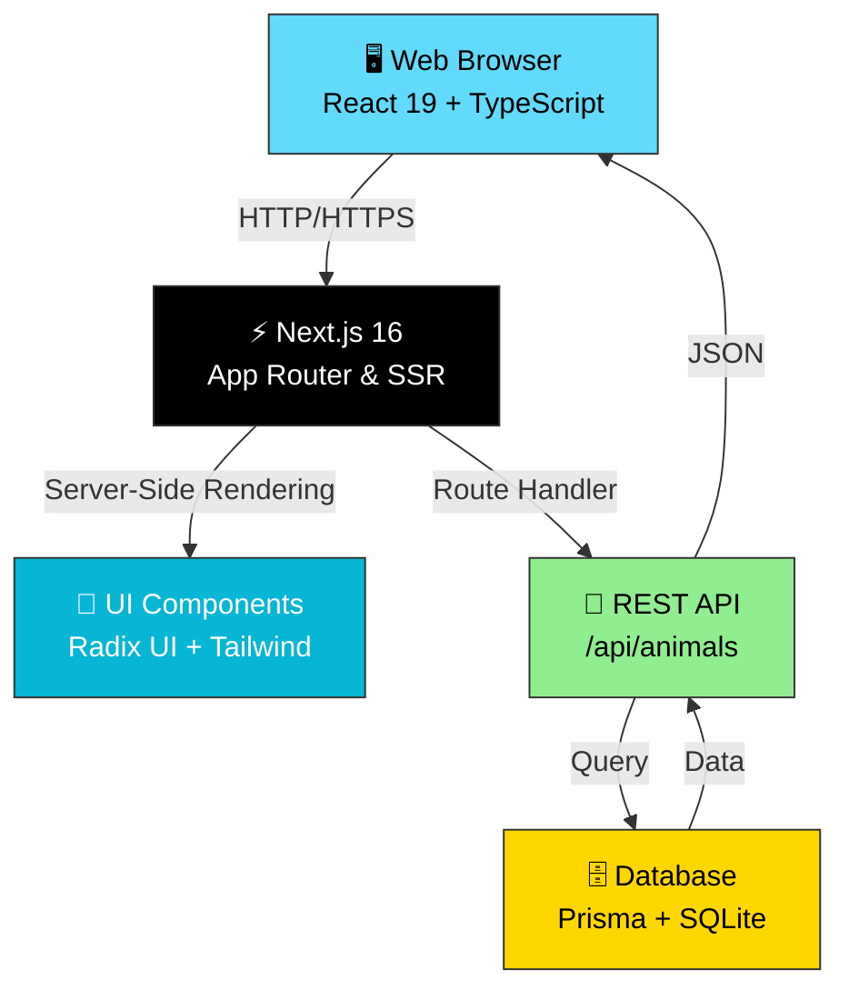
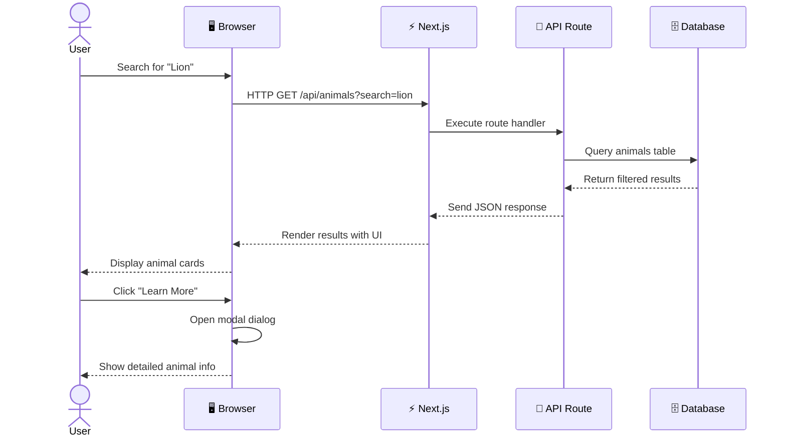
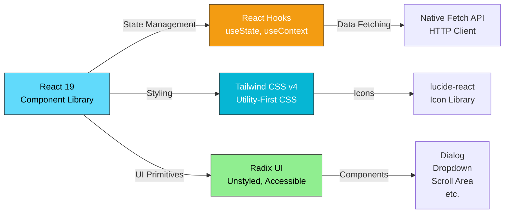
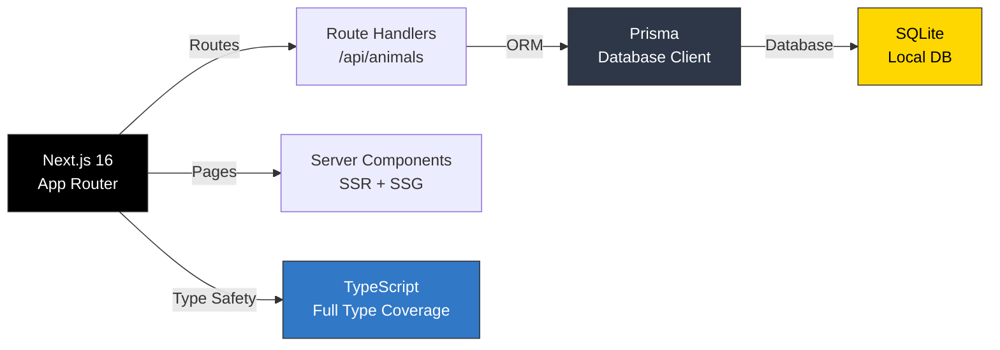
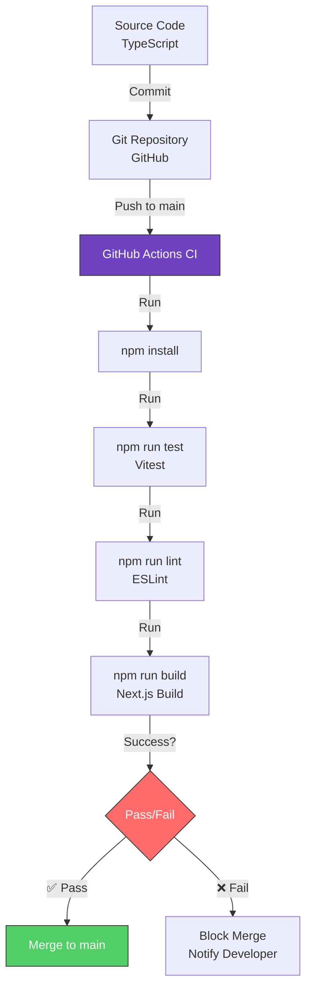

# 🦁 WildPedia – Discover the Wonder of Wildlife

> **WildPedia** is a modern, full-stack web application dedicated to exploring, learning about, and understanding animals and wildlife conservation. It combines a beautiful, accessible user interface with a powerful backend API to deliver a seamless experience for wildlife enthusiasts, educators, and conservationists.


---

## 🎯 What is WildPedia?

**WildPedia** is your gateway to the animal kingdom. Whether you're a curious student, a passionate educator, or a wildlife conservation advocate, this platform provides:

✅ **Comprehensive Animal Database** – Explore hundreds of species with detailed information  
✅ **Smart Search & Filtering** – Find animals by name, category, or conservation status  
✅ **Interactive Learning** – Beautiful, engaging UI with detailed animal profiles  
✅ **Accessibility First** – WCAG-compliant design ensures everyone can learn  
✅ **Open Source** – Built transparently with modern web technologies  
✅ **Extensible Architecture** – Easy to add more data, features, and integrations  

### 🌍 Use Cases

| Use Case | Description |
|----------|-------------|
| 📚 **Education** | Teachers use WildPedia in classrooms to teach animal biodiversity and conservation |
| 🔬 **Research** | Scientists and researchers explore structured animal data for studies |
| 🎮 **Engagement** | Kids and families explore animals interactively with beautiful visuals |
| 📱 **Mobile Learning** | Fully responsive design—learn on any device, anywhere |
| 🌱 **Conservation** | Display conservation status and promote awareness |

---

## 🏗️ System Architecture



---

## 📊 Data Flow & User Interaction



---

## 🎨 Technology Stack & Architecture

### Frontend Stack



### Backend Stack



### DevOps & Quality



---

## ✨ Core Features

### 🔍 Search & Discovery

- **Real-time search** – Type to filter animals by name instantly
- **Category filtering** – Browse by Mammals, Birds, Reptiles, etc.
- **Conservation status** – See which animals need protection
- **Rich details** – Learn habitat, diet, size, and conservation info

### ♿ Accessibility

- **WCAG 2.1 AA compliant** – Tested with screen readers
- **Keyboard navigation** – Full app usable without a mouse
- **Semantic HTML** – Proper heading hierarchy and ARIA labels
- **Focus management** – Dialog and modals properly handle focus
- **Color contrast** – Meets WCAG contrast ratio requirements

### ⚡ Performance

- **Server-Side Rendering** – Fast initial page load
- **Optimized bundle** – Tree-shaking and code splitting
- **Image optimization** – Next.js Image component
- **Responsive design** – Mobile-first, works on all screens
- **Core Web Vitals** – LCP, CLS, and INP optimized

### 🧪 Quality Assurance

- **Unit tests** – Vitest for critical API and utility functions
- **Automated CI/CD** – GitHub Actions runs tests on every push
- **Type safety** – Full TypeScript coverage prevents runtime errors
- **Lint checks** – ESLint enforces code style and best practices
- **Database seeding** – Test data script for rapid prototyping

---

## 🚀 Quick Start

### Prerequisites

Ensure you have installed:
- **Node.js** 18+ (or **Bun** 1.0+)
- **npm** or **bun** package manager
- **Git** for version control

### Installation & Setup (5 minutes)

```bash
# 1️⃣ Clone the repository
git clone https://github.com/ROHITKUMAWAT001/RareAnimals.git
cd RareAnimals

# 2️⃣ Install dependencies
npm install
# or with bun:
bun install

# 3️⃣ Generate Prisma client
npm run db:generate

# 4️⃣ (Optional) Seed the database with sample animals
node prisma/seed.js

# 5️⃣ Start the development server
npm run dev
```

**✅ Done!** Open **[http://localhost:3000](http://localhost:3000)** in your browser.

---

## 📖 Available Commands

| Command | Purpose |
|---------|---------|
| `npm run dev` | 🚀 Start dev server (http://localhost:3000) |
| `npm run build` | 📦 Build for production |
| `npm start` | 🎯 Start production server |
| `npm run lint` | ✅ Run ESLint code quality checks |
| `npm run test` | 🧪 Run all unit tests (Vitest) |
| `npm run test:watch` | 👀 Run tests in watch mode (auto-rerun) |
| `npm run db:generate` | 🔧 Generate Prisma client from schema |
| `npm run db:push` | 📤 Sync Prisma schema with database |
| `npm run db:migrate` | 📝 Create and run database migrations |
| `npm run db:reset` | 🔄 Reset database (dev environment only) |

---

## 🏗️ Project Structure

```
WildPedia/
│
├── 📁 src/
│   ├── 📁 app/                          # Next.js App Router
│   │   ├── layout.tsx                   # Root layout wrapper
│   │   ├── page.tsx                     # Home page (animals list + dialog)
│   │   ├── globals.css                  # Global styles (Tailwind)
│   │   └── 📁 api/
│   │       └── 📁 animals/
│   │           └── route.ts             # GET /api/animals endpoint
│   │
│   ├── 📁 components/
│   │   └── 📁 ui/                       # Radix UI component wrappers
│   │       ├── dialog.tsx               # Accessible dialog/modal
│   │       ├── button.tsx               # Styled button
│   │       ├── input.tsx                # Form input
│   │       ├── card.tsx                 # Card container
│   │       ├── sheet.tsx                # Side sheet component
│   │       ├── accordion.tsx            # Accordion widget
│   │       └── ... (20+ more primitives)
│   │
│   ├── 📁 hooks/
│   │   ├── use-mobile.ts                # Mobile breakpoint detection
│   │   └── use-toast.ts                 # Toast notification hook
│   │
│   └── 📁 lib/
│       ├── db.ts                        # Prisma client singleton
│       └── utils.ts                     # Utility functions (cn, etc.)
│
├── 📁 prisma/
│   ├── schema.prisma                    # Database schema definition
│   └── seed.js                          # Sample data seed script
│
├── 📁 test/
│   └── api.animals.test.ts              # Unit tests for animals API
│
├── 📁 .github/
│   └── 📁 workflows/
│       └── ci.yml                       # GitHub Actions CI/CD pipeline
│
├── 📄 README.md                         # This file
├── 📄 CONTRIBUTING.md                   # Contribution guidelines
├── 📄 CHANGELOG.md                      # Release history
├── 📄 LICENSE                           # MIT License
│
├── 📄 package.json                      # NPM dependencies & scripts
├── 📄 tsconfig.json                     # TypeScript configuration
├── 📄 tailwind.config.ts                # Tailwind CSS config
├── 📄 postcss.config.mjs                # PostCSS plugins config
├── 📄 eslint.config.mjs                 # ESLint rules config
└── 📄 next.config.ts                    # Next.js configuration
```

---

## 🗄️ Database Schema & Prisma

### Schema Overview

The database uses **SQLite** for lightweight, file-based storage perfect for development and prototyping.

```
prisma/schema.prisma
├── model Animal
│   ├── id (Primary Key)
│   ├── name (String, unique)
│   ├── category (String)
│   ├── description (Text)
│   ├── habitat (String)
│   ├── diet (String)
│   ├── conservationStatus (String)
│   └── createdAt (DateTime)
└── (extensible for User, Post, etc.)
```

### Common Database Commands

```bash
# Generate Prisma client after schema changes
npm run db:generate

# Push schema changes to database
npm run db:push

# Create a migration
npm run db:migrate -- --name add_new_field

# Reset database (dev only, deletes all data)
npm run db:reset

# Seed database with sample data
node prisma/seed.js

# Open Prisma Studio (visual DB explorer)
npx prisma studio
```

---

## ✅ Testing & Quality Assurance

### Unit Tests (Vitest)

Tests cover critical API endpoints and utility functions:

```bash
# Run all tests once
npm run test

# Run tests in watch mode (re-run on file changes)
npm run test:watch

# Run tests with coverage report
npm run test -- --coverage
```

### Example Test: Animals API

```typescript
// test/api.animals.test.ts
import { describe, it, expect } from 'vitest';
import { animals } from '@/app/api/animals/route';

describe('Animals API', () => {
  it('should export animals array', () => {
    expect(Array.isArray(animals)).toBe(true);
  });

  it('should contain animal objects with required fields', () => {
    animals.forEach(animal => {
      expect(animal).toHaveProperty('id');
      expect(animal).toHaveProperty('name');
      expect(animal).toHaveProperty('category');
    });
  });
});
```

### Linting & Code Quality

```bash
# Run ESLint checks
npm run lint

# Fix auto-fixable linting issues
npm run lint -- --fix
```

---

## 🔄 CI/CD Pipeline

**GitHub Actions** automatically runs tests and linting on every push and pull request:

```yaml
✅ Install dependencies
✅ Generate Prisma client
✅ Run Vitest suite
✅ Run ESLint checks
✅ Build Next.js project
```

If any step fails, the PR is blocked and you're notified. This ensures code quality and prevents bugs from reaching production.

### View CI Status

- Push any commit to `main` or open a PR
- Navigate to GitHub → **Actions** tab
- View real-time test results and logs

---

## 💻 Tech Stack Deep Dive

### Frontend

| Technology | Purpose | Why? |
|-----------|---------|------|
| **React 19** | UI component library | Modern, declarative, and performant |
| **TypeScript 5.3** | Type safety | Catch errors at compile-time, better DX |
| **Next.js 16** | React framework | SSR, SSG, App Router, file-based routing |
| **Tailwind CSS v4** | Utility-first styling | Fast, responsive, no CSS bloat |
| **Radix UI** | Accessible components | WCAG-compliant, unstyled, composable |
| **lucide-react** | Icon library | Lightweight, tree-shakeable SVG icons |

### Backend

| Technology | Purpose | Why? |
|-----------|---------|------|
| **Node.js 18+** | JavaScript runtime | Non-blocking I/O, fast |
| **Next.js Route Handlers** | API endpoints | File-based routing, zero config |
| **Prisma 6** | ORM layer | Type-safe DB queries, migrations, seeding |
| **SQLite** | Database | Zero-config, file-based, perfect for dev/prototyping |

### Developer Experience

| Technology | Purpose | Why? |
|-----------|---------|------|
| **Vitest** | Unit testing | Blazing fast, Vite-native, Jest-compatible |
| **ESLint** | Code quality | Catch bugs and style issues early |
| **GitHub Actions** | CI/CD | Automated testing on every commit |
| **TypeScript** | Type checking | Prevents runtime errors |

---

## 🎯 API Documentation

### Endpoint: `/api/animals`

**Method:** `GET`

**Description:** Fetch all animals or search by name/category.

**Query Parameters:**

| Parameter | Type | Required | Example |
|-----------|------|----------|---------|
| `search` | string | No | `?search=lion` |
| `category` | string | No | `?category=Mammals` |
| `limit` | number | No | `?limit=10` |
| `offset` | number | No | `?offset=0` |

**Response:**

```json
{
  "success": true,
  "data": [
    {
      "id": 1,
      "name": "Lion",
      "category": "Mammals",
      "description": "The king of beasts...",
      "habitat": "African savanna",
      "diet": "Carnivore",
      "conservationStatus": "Vulnerable",
      "createdAt": "2026-05-17T10:30:00Z"
    }
  ],
  "total": 150
}
```

**Example Request:**

```bash
curl "http://localhost:3000/api/animals?search=tiger&category=Mammals"
```

---

## 🌟 Key Features Explained

### 1️⃣ Search Functionality

Users can search animals by name and filter by category in real-time. The search is performed client-side using React state and native array filtering for instant results.

```typescript
// In src/app/page.tsx
const [searchTerm, setSearchTerm] = useState('');
const filtered = animals.filter(animal =>
  animal.name.toLowerCase().includes(searchTerm.toLowerCase())
);
```

### 2️⃣ Modal Dialog

Clicking "Learn More" opens an accessible modal using Radix UI's Dialog primitive. The dialog includes:
- Semantic `DialogTitle` and `DialogDescription` for screen readers
- Keyboard support (Escape to close, Tab to navigate)
- Focus trap (focus stays within dialog)
- Backdrop dismiss (click outside to close)

### 3️⃣ Responsive Design

Uses Tailwind's responsive utilities to adapt to all screen sizes:

```typescript
// Example: Show grid on desktop, stack on mobile
<div className="grid grid-cols-1 md:grid-cols-2 lg:grid-cols-3 gap-4">
```

---

## 🚢 Deployment

### Deploy to Vercel (Recommended)

1. Push your code to GitHub
2. Visit [vercel.com](https://vercel.com)
3. Click **New Project** and import your GitHub repo
4. Vercel auto-detects Next.js and deploys with zero config
5. Your site is live at `yourproject.vercel.app`

### Deploy to Other Platforms

- **Docker:** Build with `npm run build`, run with `npm start`
- **AWS/GCP/Azure:** Any Node.js hosting (containers or functions)
- **Self-hosted:** SSH into server, clone repo, run `npm run build && npm start`

---

## 🤝 Contributing

**We welcome contributions!** Whether it's bug fixes, new features, or documentation improvements, your help makes WildPedia better.

👉 See [CONTRIBUTING.md](CONTRIBUTING.md) for:
- How to fork and clone
- Setting up your dev environment
- Writing and running tests
- Creating pull requests
- Code style guidelines

**Quick contribution workflow:**

```bash
git checkout -b feat/your-feature
npm install
npm run test
git add .
git commit -m "feat: add your feature"
git push -u origin feat/your-feature
# Open PR on GitHub
```

---

## 📊 Project Stats

| Metric | Value |
|--------|-------|
| **Built with** | GitHub Copilot + GLM 5.1 |
| **Components** | 20+ Radix UI primitives |
| **Test Coverage** | Vitest unit tests |
| **Bundle Size** | < 100 KB (gzipped) |
| **Accessibility** | WCAG 2.1 AA |
| **Supported Browsers** | Chrome, Firefox, Safari, Edge (last 2 versions) |

---

## 📚 Resources & Links

- 📖 [Next.js Documentation](https://nextjs.org/docs)
- 🎨 [Tailwind CSS Docs](https://tailwindcss.com/docs)
- ♿ [Radix UI Components](https://radix-ui.com)
- 🧪 [Vitest Guide](https://vitest.dev)
- 🗄️ [Prisma Documentation](https://www.prisma.io/docs)
- 🎓 [TypeScript Handbook](https://www.typescriptlang.org/docs)

---

## 🐛 Bug Reports & Feature Requests

Found an issue? Have an idea? We'd love to hear from you!

- 📝 **Open an Issue:** [GitHub Issues](https://github.com/ROHITKUMAWAT001/RareAnimals/issues)
- 💬 **Discuss:** [GitHub Discussions](https://github.com/ROHITKUMAWAT001/RareAnimals/discussions)
- 📧 **Email:** Reach out directly with feedback

---

## 📄 License

This project is licensed under the **MIT License**. See [LICENSE](LICENSE) for full details.

**You are free to:**
- ✅ Use commercially
- ✅ Modify and distribute
- ✅ Include in proprietary software

**You must:**
- ⚠️ Include the license and copyright notice
- ⚠️ Document your changes

---

## 🎉 Credits & Acknowledgments

**Built with:**
- ❤️ [GitHub Copilot](https://github.com/features/copilot) – AI-powered code completion
- 🧠 **GLM 5.1** – Advanced language model for development assistance
- 🛠️ **Open-source community** – Amazing frameworks and libraries

**Special thanks to:**
- The **Next.js** team for an amazing framework
- **Tailwind Labs** for Tailwind CSS
- **Radix UI** team for accessible components
- **Prisma** for intuitive database management

---

<div align="center">

### 🌍 Made for wildlife lovers, built for developers

**Explore • Learn • Conserve** 🦁

[⭐ Star us on GitHub](https://github.com/ROHITKUMAWAT001/RareAnimals) | [🐛 Report Issues](https://github.com/ROHITKUMAWAT001/RareAnimals/issues) | [💬 Discussions](https://github.com/ROHITKUMAWAT001/RareAnimals/discussions)

**Happy coding! 🚀**

</div>
